# AeroResolve — Architecture Specification

## Architecture Overview

AeroResolve operates as an end-to-end Aircraft Health-to-Action platform built primarily on the Snowflake Data Cloud, leveraging Snowflake-native Cortex AI services, Snowpark ML, Dynamic Tables, Streams & Tasks, Semantic Views, Cortex Search, and Model Context Protocol (MCP) integrations.

```mermaid
flowchart TD
    subgraph Ingestion ["1. Data Ingestion & Replay"]
        Sim["Live Telemetry Replay / Micro-Batch Simulator"]
        Raw["AERORESOLVE.RAW.TELEMETRY_STREAM"]
        Sim -->|Ingests Accelerated Observations| Raw
    end

    subgraph Transformation ["2. Continuous Transformation"]
        Curated["AERORESOLVE.CURATED.FACT_TELEMETRY"]
        DT_Health["Dynamic Table: DT_AIRCRAFT_HEALTH_WINDOW"]
        DT_Recurrence["Dynamic Table: DT_FAULT_RECURRENCE_FEATURES"]
        DT_Station["Dynamic Table: DT_STATION_READINESS"]
        Raw --> Curated
        Curated --> DT_Health
        Curated --> DT_Recurrence
        Curated --> DT_Station
    end

    subgraph ML_Semantic ["3. Intelligence & Semantic Layer"]
        ML_Anomaly["Snowflake ML: Anomaly Detection (Avionics, Vibration, Temp)"]
        ML_AOG["Snowflake ML / Model: AOG Risk Classifier"]
        Semantic["Snowflake Semantic Views (Fleet, Maintenance, Stations, Flights)"]
        Cortex_Search["Snowflake Cortex Search (Technical Documents & Handover Notes)"]
        DT_Health --> ML_Anomaly
        DT_Recurrence --> ML_AOG
    end

    subgraph Agents ["4. Cortex Agentic Architecture"]
        Orchestrator["AERORESOLVE_ORCHESTRATOR (Cortex Agent)"]
        HealthAgent["Health Agent (Telemetry Anomaly)"]
        RepeatDefectAgent["Repeat Defect Agent (History & Recurrence)"]
        RootCauseAgent["Root Cause Agent (Hypothesis Synthesis)"]
        GroundAgent["Ground Readiness Agent (Spares & Tooling)"]
        OpsAgent["Operations Impact Agent (Blast Radius & Delays)"]
        VerificationAgent["Repair Verification Agent (Post-Repair Surveillance)"]
        
        Orchestrator --> HealthAgent
        Orchestrator --> RepeatDefectAgent
        Orchestrator --> RootCauseAgent
        Orchestrator --> GroundAgent
        Orchestrator --> OpsAgent
        Orchestrator --> VerificationAgent

        HealthAgent --> ML_Anomaly
        RepeatDefectAgent --> Semantic
        RootCauseAgent --> Cortex_Search
        GroundAgent --> DT_Station
        OpsAgent --> Semantic
    end

    subgraph HumanGate ["5. Human-in-the-Loop & External Action"]
        Audit["AERORESOLVE.AUDIT.AGENT_CASE & AGENT_STEP"]
        ApprovalUI["Human Approval Gate (Operations Controller)"]
        MCP["MCP Integration (Jira / GitHub Work Item)"]
        
        Orchestrator --> Audit
        Orchestrator --> ApprovalUI
        ApprovalUI -->|Explicit Approval| MCP
        MCP -->|Ticket Key / External Action ID| Audit
    end

    subgraph Verification ["6. Post-Repair Surveillance"]
        Surveillance["Post-Repair Flight Surveillance"]
        FleetMemory["Fleet Case Memory / Precedent Store"]
        VerificationAgent --> Surveillance
        Surveillance -->|Signature Cleared| FleetMemory
    end
```

## Database Schema Design (`AERORESOLVE`)
1. **`RAW`**: Append-only ingestion tables (telemetry streams, ACARS alerts, raw maintenance logs).
2. **`CURATED`**: Clean, deduplicated dimensional and operational entities (aircraft, flights, components, faults, parts).
3. **`FEATURES`**: Rolling aggregations, baselines, degradation features, and environmental metrics.
4. **`ML`**: Anomaly detection models, inference tables, and AOG risk predictions.
5. **`KNOWLEDGE`**: Unstructured technical manuals, troubleshooting guides, and Cortex Search staging.
6. **`SEMANTIC`**: Snowflake Semantic Views exposing metrics, dimensions, and verified queries.
7. **`AGENTS`**: Cortex Agent configurations, custom tool definitions, and skill specifications.
8. **`OPS`**: Active operational plans, part repositioning orders, and rotation tracking.
9. **`APP`**: Application backend state, live simulation tracking, and user session data.
10. **`EVAL`**: Hidden ground truth scenario tables, expected tool sequences, and automated benchmark datasets.
11. **`AUDIT`**: Full investigation traces, tool calls, human decisions, and external action links.

## Autonomous Agent State Machine & Guardrails
- **Max Iterations**: 8 steps per investigation to avoid infinite recursion.
- **Cost Guardrail**: Efficient token budgets, scoped search results (k=5 max).
- **Dual Evidence Rule**: A high-confidence root-cause recommendation requires >= 2 independent evidence categories (e.g. Telemetry anomaly + Maintenance history, or History + Cortex Search manual citation).
- **Hard Airworthiness Boundary**: The agent NEVER signs release-to-service, never alters MEL, and never dispatches an aircraft.
