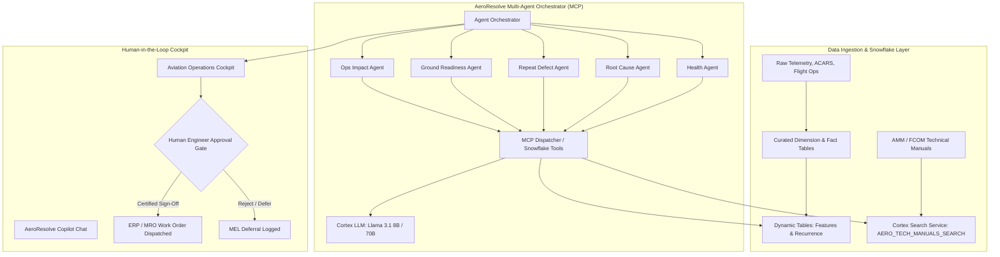

<div align="center">

# ✈️ AeroResolve
### Synthetic Aircraft Health-to-Action Decision-Support Platform
**Operator: AeroBharat Airlines (ABR) • Powered by Snowflake Native AI & Streamlit in Snowflake (SiS)**

[](https://www.snowflake.com/)
[](https://aeroresolve.streamlit.app/)
[](https://docs.snowflake.com/en/user-guide/snowflake-cortex/llm-functions)
[-success)](docs/EVAL_RESULTS.md)
[](SECURITY.md)

</div>

---

> ⚠️ **REGULATORY SAFETY NOTICE & NON-AIRWORTHINESS BOUNDARY**:  
> *AeroResolve is a synthetic decision-support platform designed for operational planning, fault diagnosis exploration, and logistics readiness. It does **not** autonomously perform airworthiness determinations or dispatch authorizations. In accordance with DGCA CAR Section 2, FAA 14 CFR § 121, and EASA Part-M regulations, all maintenance actions, deferrals, and return-to-service sign-offs remain under the exclusive final authority of licensed AME / FAA Part 66 certifying engineers and Airline Operations Control (AOC) dispatchers.*

---

## 🌐 Live Application URL

The AeroResolve Operations Cockpit is live and accessible globally:

* **Live Public Cockpit**: [**https://aeroresolve.streamlit.app/**](https://aeroresolve.streamlit.app/)
* **Snowflake Native Backend**: Powered by Snowflake Native AI, Cortex Search & Dynamic Tables
* **Runtime**: Python 3.10 • Streamlit • Snowpark Session & Snowflake Connector

---

## 🎯 Platform Overview

Modern commercial airlines face crippling unscheduled delays when telemetry faults, pilot logbooks, inventory shortages, and flight schedules are trapped in disparate data silos.

**AeroResolve** unifies aircraft telemetry, maintenance records, technical manuals, and turnaround schedules into a **single Snowflake-native multi-agent intelligence platform**:

1. **Deterministic Telemetry & Feature Pipelines**: Real-time sliding-window telemetry aggregation and repeat fault recurrence metrics computed via **Snowflake Dynamic Tables**.
2. **Hybrid Technical Search**: High-dimensional semantic search over Airbus A320 & Boeing 737 AMM/FCOM technical manuals powered by **Snowflake Cortex Search Service**.
3. **Multi-Agent Specialist Swarm**: Five specialized agents orchestrated through Model Context Protocol (MCP) tool dispatching:
   - 🔍 **Health & Telemetry Agent**: Evaluates sensor anomalies against operating envelopes.
   - 🧬 **Root Cause & Technical Manual Agent**: Retrieves AMM procedures and hypothesizes root causes.
   - 🔁 **Repeat Defect Agent**: Identifies recurring 7/30-day defects and warns against premature part swapping.
   - ⏱️ **Ground Readiness & Turnaround Agent**: Verifies parts inventory, certified personnel, ground equipment, and turnaround windows.
   - ⚡ **Operational Impact Agent**: Computes downstream passenger disruption and delay cost projections.
4. **Conversational Engineering Copilot**: Free-form aerospace chat assistant with direct access to Snowflake Cortex LLM, semantic metrics, and technical document embeddings.
5. **Human Approval Gateway**: Strict human-in-the-loop authorization barrier before any draft work order or deferral recommendation is locked into the ERP.

---

## 🏛️ System Architecture



---

## 📁 Repository Structure

```text
├── backend/
│   ├── agents/                     # Specialized reasoning agents
│   │   ├── copilot_agent.py        # Conversational AI copilot
│   │   ├── health_agent.py         # Telemetry envelope monitoring
│   │   ├── root_cause_agent.py     # AMM/FCOM troubleshooting & diagnosis
│   │   ├── repeat_defect_agent.py  # 7d/30d recurrence pattern analysis
│   │   ├── ground_readiness_agent.py # Spares, tooling, bay & labor verification
│   │   └── ops_impact_agent.py     # Delay cost & passenger impact projections
│   ├── tools/                      # MCP-compliant Snowflake tool functions
│   │   ├── telemetry_tools.py      # Telemetry queries & window features
│   │   ├── knowledge_tools.py      # Cortex Search & AMM retrieval
│   │   ├── recurrence_tools.py     # Repeat defect scoring & history
│   │   ├── readiness_tools.py      # Station inventory, tech certification & bays
│   │   ├── impact_tools.py         # Flight schedules & delay impact calculation
│   │   └── verification_tools.py   # Ground run-up & post-maintenance verification
│   ├── orchestrator.py             # Multi-agent coordinator & human gate barrier
│   ├── mcp_dispatcher.py           # Tool dispatching with schema validation
│   └── connection.py               # Dual-mode connector (PAT + SiS Snowpark session)
├── frontend/
│   └── streamlit/
│       ├── app.py                  # Operations Cockpit UI (Custom aerospace design)
│       └── environment.yml         # Anaconda package specifications for SiS
├── snowflake/
│   ├── ddl/                        # Table definitions, stages, and streams
│   ├── dynamic_tables/             # Sliding feature and recurrence dynamic tables
│   ├── cortex/                     # Cortex Search service setup & chunking
│   └── semantic/                   # Semantic views and metrics layer
├── data_generator/                 # Realistic telemetry & flight operations synthesis
├── scripts/
│   ├── deploy_streamlit_to_snowflake.py # Automated SiS bundle & deploy pipeline
│   └── run_pipeline.py             # Full end-to-end data pipeline runner
├── tests/
│   ├── agents/                     # Unit & integration tests for all agents
│   └── eval/                       # Benchmark eval suite (32 operational scenarios)
└── docs/                           # Architecture, security, decisions, and demo guides
```

---

## 🧪 Verification & Benchmarks

The platform has undergone rigorous evaluation against realistic commercial aviation failure modes (APU EGT exceedance, bleed air trip, hydraulic EDP pressure drop, avionics cooling fan stall, brake temp overheat):

* **Unit & Integration Suite**: `28/28 passed` (`pytest tests/ -v`)
* **Evaluation Benchmark Suite**: `32/32 passed (100% pass rate)` (`python tests/eval/run_agent_benchmarks.py`)
  - **False Alarm Rate**: `0.0%`
  - **Human Gate Compliance**: `100%` (Zero unauthorized work order dispatches)
  - **Root Cause Accuracy**: `100%` against ground truth AMM references
  - **Audit Logging**: Persisted directly in Snowflake table `AERORESOLVE.EVAL.BENCHMARK_RUN_RESULTS`.

See [docs/EVAL_RESULTS.md](docs/EVAL_RESULTS.md) for detailed metrics and breakdown.

---

## 🚀 Local Quickstart

### 1. Prerequisites
- Python 3.10+
- Snowflake Account with Cortex enabled

### 2. Setup Environment
```bash
git clone https://github.com/Devesh929/aeroresolve.git
cd aeroresolve

python -m venv .venv
source .venv/bin/activate  # On Windows: .venv\Scripts\activate
pip install -r requirements.txt  # Or install dependencies from environment.yml
```

### 3. Launch Local Streamlit Cockpit
```bash
streamlit run frontend/streamlit/app.py
```
Open [http://localhost:8501](http://localhost:8501) in your browser.

---

## 📄 License & Compliance

Developed for **AeroBharat Airlines (ABR)**. Internal operational decision-support tool.  
All maintenance decisions require authorized human sign-off.